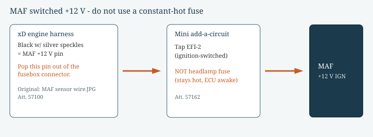
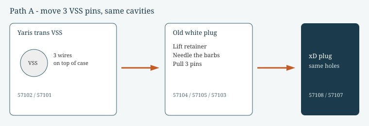
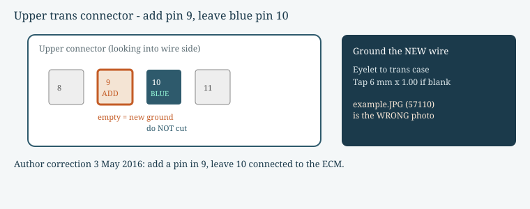
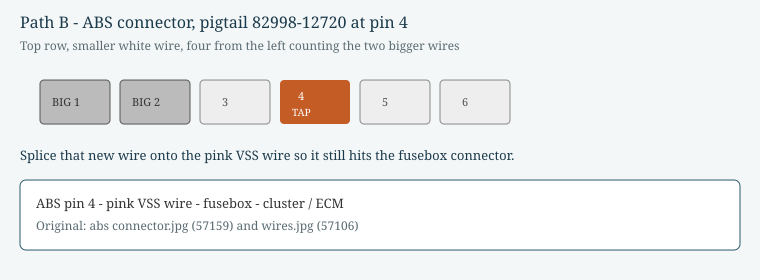

# Figures

These SVGs reconstruct pin locations described in the source posts. They are **not** the original JPEGs. Each figure lists the post and attachment ID it replaces.

Primary post used: [brushforhire, Wiring and electronic issues, t=56678 post #4](https://yarisworld.com/forums/showpost.php?p=781189&postcount=4).

Full source list: [CITATIONS.md](CITATIONS.md).

---

## Figure 1 — MAF switched +12 V

Replaces: `MAF sensor wire.JPG` (att. **57100**), `add a circuit.jpg` (att. **57162**).

Source: brushforhire, t=56678 post #4, 12 May 2016. Fuse-slot warning (EFI-2, not headlamp): tmontague, t=61572, 4 Feb 2019. CA2 pin 9 has no Yaris fusebox pin: ArmstrongRacing, t=56031, 20 Jan 2016.

---

## Figure 2 — Move the 3 VSS pins

Replaces: att. **57102, 57101, 57104, 57105, 57103, 57106, 57108, 57107** (`speed plug.JPG` through `this is how they go in.JPG`).

Source: brushforhire, t=56678 post #4; photo walk-through also in t=56233 post #50.

---

## Figure 3 — Cavity 9 ground, leave blue cavity 10

Replaces: `blue wire.JPG` (att. **57109**). Do **not** copy `example.JPG` (att. **57110**) — author said that photo is wrong.

Source: brushforhire, t=56678 post #4 (*"The following picture is not correct... do not cut the blue wire"*). Correction restated t=56233 post #51, edited 3 May 2016.

---

## Figure 4 — ABS pin 4 speed tap

Replaces: `abs connector.jpg` (att. **57159**), follow-up photos att. **57160, 57161** (t=56233, 23 May 2016).

Source: brushforhire, t=56678 post #4 and the 12 May 2016 05:44 PM follow-up (tried A15 pin 11 w/ VSC or pin 22 w/o VSC first; working cavity is **4**). Pigtail **82998-12720**. GPS vs cluster check in t=56233, 23 May 2016.
